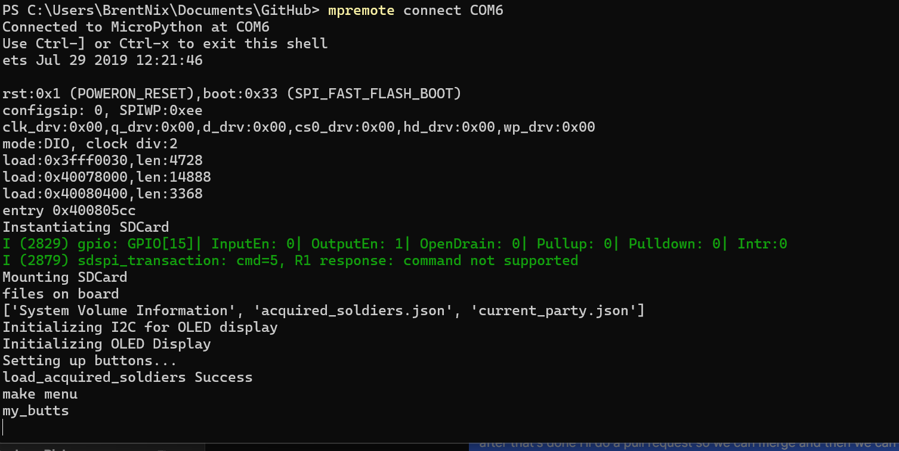

# Hardware Setup

## Parts List

These setup instructions are for this specific hardware:
- [ESP-WROOM-32 dev board](https://www.amazon.com/dp/B08D5ZD528?psc=1&ref=ppx_yo2ov_dt_b_product_details)
- [ssd1306 display shield](https://www.amazon.com/dp/B09C5K91H7?psc=1&ref=ppx_yo2ov_dt_b_product_details) 
- [4x Pushbuttons](https://www.amazon.com/dp/B00R17XUFC?psc=1&ref=ppx_yo2ov_dt_b_product_details) 
- ~[microSD card reader](https://www.amazon.com/gp/product/B0989SM146/ref=ppx_yo_dt_b_asin_title_o00_s01?ie=UTF8&psc=1_)~ Do not use the SD Card Reader!!!!! It is very heat-sensitive and has a pretty high fail rate in testing while getting soldered. 
- Mimiku Board
- AAA 3 battery pack
- Double-sided foam tape

## Flashing the firmware:
Please complete this step before soldering - just in case the ESP32 is DOA so that you don't have to de-solder all those pins. 

### Install these tools
- mpremote
- esptool
you can install them with pip, (comes with python) or brew (on mac), or some other package manager

### Flashing Micropython:

I have COM6 listed here as the port, but you can use
`> mpremote connect list`
to list the available ports to connect to.
If its the first time you are installing micropython, or just want to start over with a fresh slate, erase the onboard flash memory with this command:
`> esptool --chip esp32 --port /dev/ttyUSB0 erase_flash`
Then flash the board with this version of the micropython that you download from [here](https://micropython.org/resources/firmware/ESP32_GENERIC-20240222-v1.22.2.bin). 
`> esptool --port COM6 --chip esp32 --baud 460800 write_flash -z 0x1000 '<path-to-file>\ESP32_GENERIC-20240222-v1.22.2.bin'`

### Install required packages to the board:
This code won't work without pulling installing these packages - just drop these commands in the command line
`> mpremote mip install github:peterhinch/micropython-async/v3/primitives`
`> mpremote mip install github:peterhinch/micropython-async/v3/threadsafe`

### Pushing Files to the ESP32 Board
Use mpremote to push the firmware to the board
make sure that you do this command 
`> mpremote fs cp ./* :`
Note the trailing colon. you need that because it specifies the root of the filesystem on the board. If you need to put something into a folder you would do something like this:
`> mpremote fs cp ./foo.txt :adventure/`
make sure to read the mpremote docs if you are confused, or reach out to n1x1e with questions

If you have any issues starting the badge you can use mpremote to get some debug feedback:
`> mpremote connect <port>`

and then reset the board by pressing the "EN" button next to the USB port on the ESP32.
You should see something like this in the terminal:

